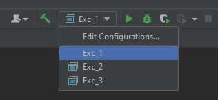

# JavaPatternMirea

### Задания по Java <small><small>(второй курс, весенний семестр)</small></small>
> Группа: **ИКБО-01-20** 
> ФИО: **Баикин Кирилл Евгеньевич**

Все задания разделены на пакеты и находятся в папке `src`. Если открывать через
Intellij IDEA, то конфигурации для запуска каждого задания уже имеются:

